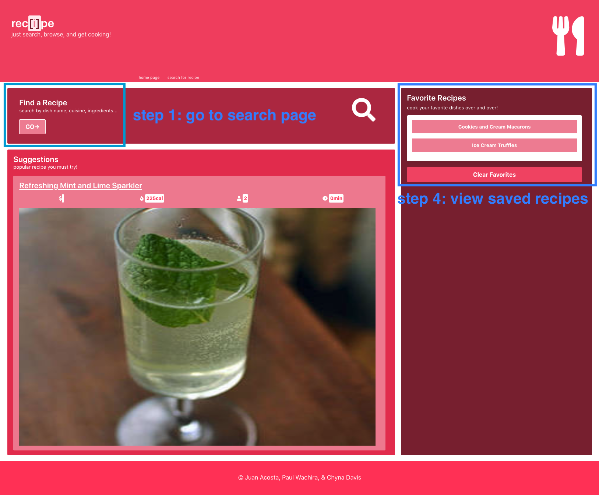
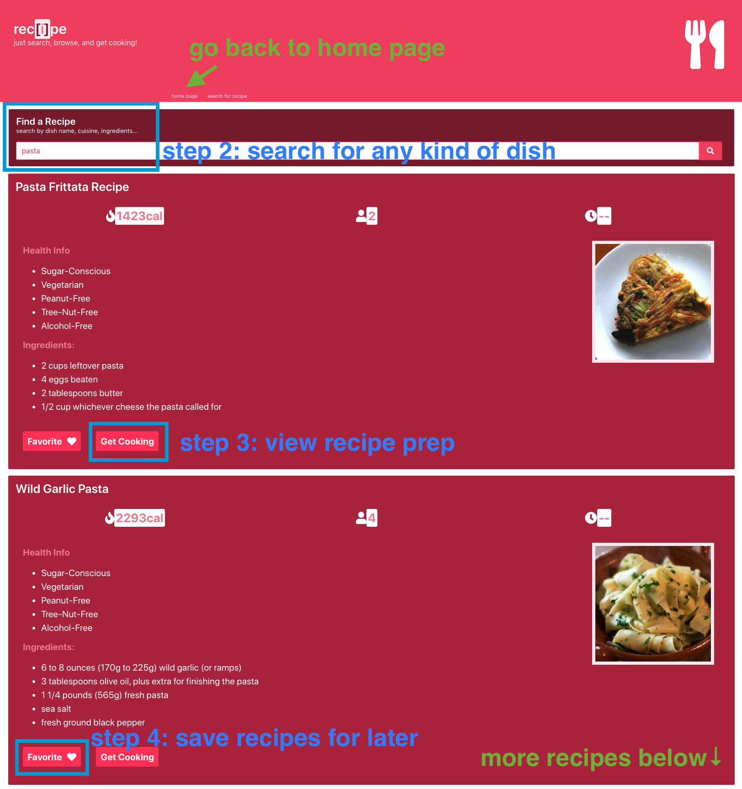

# Recipe Finder
     

---

## Description:
This application allows the user to view popular recipes, search for recipes based on a keyword such as "cookies", "pasta", or "vegan", or save their favorite recipes to be made again and again. Each search allows the user to view 10 recipes from the Edamam API. The generated recipes also come with the list of ingredients, nutritional information, estimated cost (provided by the Spoonacular API), an image, and a link to the preparation instructions. 

---

## Table of Contents:
* [Installation](#installation)
* [Usage](#usage)
* [Demonstration](#demonstration)
* [License](#license)
* [Resources](#resources)
* [Contributors](#contributors)

---

## Installation:
None is required.

---

## Usage:
Go to [this link](https://juandaniel0530.github.io/RecipeFinder/) to use the application.

How to use:
* __step 1:__ Click the "GO" button to find a recipe.
* __step 2:__ Search for any kind of recipe, and browse through the 10 generated suggestions.
* __step 3:__ To view the preparation instructions, click the "Get Cooking" button. This will open up a new browser tab, which will take you to the recipe's page.
* __step 4 (optional):__ If you like any of the recipes, click the "Favorite" button to save them. These saved recipes can be viewed again on the _Home Page_.

---

## Demonstration:
Go to [this link](https://drive.google.com/file/d/1pN7Pvg6ewkztv7dACnNpnSLQWb5qZjL-/view) to see a video demo on how to use RecipeFinder, or see images below:

---

## License:
[MIT License](https://opensource.org/licenses/MIT)

---

## Resources:
* APIs:
  * [Edamam API](https://developer.edamam.com/)
  * [Spoonacular API](https://spoonacular.com/food-api)
* technologies:
  * [Bulma CSS Framework](https://bulma.io/documentation/overview/start/)
  * [jQuery library](https://jquery.com/)
  * [anime.js libary](https://animejs.com/)

---

## Contributors:
* Chyna Davis (https://github.com/CrainDavis)
* Juan Acosta (https://github.com/juandaniel0530)
* Paul Wachira (https://github.com/paulcmd)